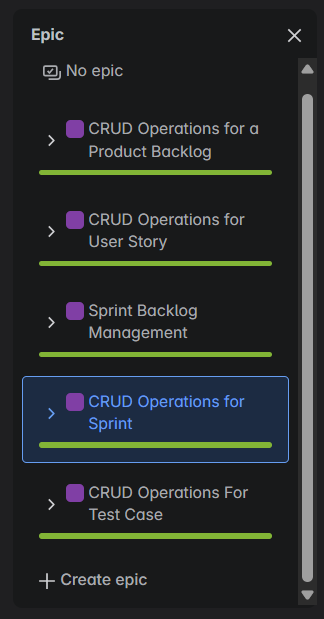

# Agile Project Management System

## Overview

This application is a comprehensive Spring Boot-based RESTful API for Agile project management. It implements a complete Scrum workflow system, allowing users to create and manage projects, product backlogs, sprint backlogs, epics, user stories, and test cases.

## Project Structure


## Features

- **User Authentication & Authorization**: JWT-based secure authentication with role-based access control
- **Project Management**: Create, update, and manage project details
- **Product Backlog Management**: Organize requirements at high level
- **Sprint Planning**: Create and manage sprint backlogs
- **User Story Management**: Track detailed requirements with acceptance criteria
- **Epic Management**: Group related user stories
- **Test Case Management**: Create and track test cases linked to user stories
- **Role-based access control**: Different permissions for Product Owners, Scrum Masters, Developers, and QA Engineers

## Implemented User Stories

### Product Backlog Operations


### Sprint, Epic and User Story Management


### Epic Categories


## Technology Stack

- **Framework**: Spring Boot 3.x
- **Database**: MySQL 8.0
- **Security**: Spring Security with JWT
- **ORM**: Spring Data JPA / Hibernate
- **Documentation**: SpringDoc OpenAPI (Swagger UI)
- **Testing**: JUnit 5 with Mockito
- **Build Tool**: Maven
- **Java Version**: 17

## Domain Model

The application is structured around the following core entities:

- **User**: Application users with different roles (Product Owner, Scrum Master, Developer, QA Engineer)
- **Project**: Container for all project artifacts
- **ProductBacklog**: Collection of all requirements
- **SprintBacklog**: Requirements selected for a specific iteration
- **Epic**: Large work units that can be broken into smaller stories
- **UserStory**: Specific functionality requirements with roles, goals, and desires
- **TestCase**: Verification criteria for user stories
- **Role**: Project-specific roles (personas) used in user stories

## Getting Started

### Prerequisites

- JDK 17+
- Maven 3.6+
- MySQL 8.0+

### Configuration

1. Clone the repository:
```bash
git clone https://github.com/yourusername/MiniProjetSpring.git
```

2. Configure the database connection in `src/main/resources/application.properties`:
```properties
spring.datasource.url=jdbc:mysql://localhost:3306/miniprojectspring
spring.datasource.username=your_username
spring.datasource.password=your_password
```

3. Build the project:
```bash
mvn clean install
```

4. Run the application:
```bash
mvn spring-boot:run
```

### API Documentation

Once the application is running, you can access the Swagger UI documentation at:
```
http://localhost:8080/swagger-ui/index.html
```

## API Endpoints

The system exposes the following main API endpoints:

- **Authentication**: `/auth/signup`, `/auth/login`
- **Projects**: `/api/projects`
- **Product Backlogs**: `/api/product-backlogs`
- **Sprint Backlogs**: `/api/sprint-backlogs`
- **Epics**: `/api/epics`
- **User Stories**: `/api/user-stories`
- **Test Cases**: `/api/test-cases`
- **Roles**: `/api/roles`

## Security Model

The system implements a comprehensive security model:

- **Authentication**: JWT token-based authentication
- **Authorization**:
  - PRODUCT_OWNER: Full access to all project resources
  - SCRUM_MASTER: Can invite users and manage sprints
  - DEVELOPER: Can update user stories
  - QUALITY_ASSURANCE: Can create and manage test cases

## Testing

The project includes unit tests for services and integration tests for controllers. Run tests with:

```bash
mvn test
```

## Detailed API Documentation

### Table of Contents
1. [Introduction](#introduction)
2. [Authentication](#authentication)
3. [Endpoint Groups](#endpoint-groups)
4. [Data Models](#data-models)
5. [Authorization Rules](#authorization-rules)

### Introduction

This API provides endpoints for an Agile/Scrum project management application. It allows users to create and manage projects, product backlogs, sprint backlogs, epics, user stories, and test cases following Agile methodologies.

Base URL: `https://localhost:8080`

### Authentication

The API uses JWT (JSON Web Token) for authentication.
- JWT Authentication Filter: Intercepts requests to validate tokens
- Security Configuration: Defines protected endpoints and required roles

#### Authentication Endpoints

| Method | Endpoint | Description |
|--------|----------|-------------|
| POST | /auth/signup | Register a new user |
| POST | /auth/login | Authenticate a user and receive JWT token |

### Endpoint Groups

#### Auth Endpoints

**Register User**
- POST `/auth/signup`
- Request Body:
```json
{
  "fullName": "string",
  "email": "string",
  "password": "string"
}
```
- Response: User object

**Login**
- POST `/auth/login`
- Request Body:
```json
{
  "email": "string",
  "password": "string"
}
```
- Response:
```json
{
  "token": "string",
  "expiresIn": 0
}
```

#### User Management

**Get Current User**
- GET `/api/me`
- Response: User object

**Invite User to Project**
- POST `/api/projects/invite`
- Request Body:
```json
{
  "fullName": "string",
  "email": "string",
  "password": "string",
  "previlige": "SCRUM_MASTER|PRODUCT_OWNER|DEVELOPER|QUALITY_ASSURANCE"
}
```
- Response: User object

#### Projects

**Create Project**
- POST `/api/projects`
- Request Body:
```json
{
  "name": "string",
  "description": "string"
}
```
- Response: Project object

**Get Project**
- GET `/api/projects`
- Response: Project object

**Update Project**
- PUT `/api/projects`
- Request Body:
```json
{
  "name": "string",
  "description": "string"
}
```
- Response: Project object

**Delete Project**
- DELETE `/api/projects`
- Response: Empty object

#### Roles

**Create Role**
- POST `/api/roles`
- Request Body:
```json
{
  "name": "string",
  "description": "string"
}
```
- Response: Role object

**Get Roles by Project ID**
- GET `/api/roles`
- Response: Array of Role objects

**Get Role by ID**
- GET `/api/roles/{id}`
- Response: Role object

**Update Role**
- PUT `/api/roles/{id}`
- Request Body:
```json
{
  "name": "string",
  "description": "string"
}
```
- Response: Role object

**Delete Role**
- DELETE `/api/roles/{id}`
- Response: Empty object

#### Product Backlogs

**Create Product Backlog**
- POST `/api/product-backlogs`
- Request Body:
```json
{
  "name": "string"
}
```
- Response: ProductBacklog object

**Get Product Backlog**
- GET `/api/product-backlogs`
- Response: ProductBacklog object

**Update Product Backlog**
- PUT `/api/product-backlogs`
- Request Body:
```json
{
  "name": "string"
}
```
- Response: ProductBacklog object

**Delete Product Backlog**
- DELETE `/api/product-backlogs`
- Response: Empty object

#### Sprint Backlogs

**Create Sprint Backlog**
- POST `/api/sprint-backlogs`
- Request Body:
```json
{
  "name": "string",
  "description": "string"
}
```
- Response: SprintBacklog object

**Get Sprint Backlog by ID**
- GET `/api/sprint-backlogs/{id}`
- Response: SprintBacklog object

**Update Sprint Backlog**
- PUT `/api/sprint-backlogs/{id}`
- Request Body:
```json
{
  "name": "string",
  "description": "string"
}
```
- Response: SprintBacklog object

**Delete Sprint Backlog**
- DELETE `/api/sprint-backlogs/{id}`
- Response: Empty object

#### Epics

**Create Epic**
- POST `/api/epics`
- Request Body:
```json
{
  "name": "string",
  "description": "string",
  "epicPriority": "HIGH|MEDIUM|LOW",
  "epicStatus": "TO_DO|IN_PROGRESS|DONE",
  "dueDate": "date-time"
}
```
- Response: Epic object

**Get Epics by Product Backlog ID**
- GET `/api/epics`
- Response: Array of Epic objects

**Get Epic by ID**
- GET `/api/epics/{id}`
- Response: Epic object

**Update Epic**
- PUT `/api/epics/{id}`
- Request Body:
```json
{
  "name": "string",
  "description": "string",
  "epicPriority": "HIGH|MEDIUM|LOW",
  "epicStatus": "TO_DO|IN_PROGRESS|DONE",
  "dueDate": "date-time"
}
```
- Response: Epic object

**Delete Epic**
- DELETE `/api/epics/{id}`
- Response: Empty object

**Link Epic to Sprint Backlog**
- POST `/api/epics/{epicId}/link/sprint-backlog/{sprintBacklogId}`
- Response: Epic object

**Unlink Epic from Sprint Backlog**
- POST `/api/epics/{epicId}/unlink`
- Response: Epic object

#### User Stories

**Create User Story**
- POST `/api/user-stories`
- Request Body:
```json
{
  "title": "string",
  "description": "string",
  "roleId": "string",
  "goal": "string",
  "desire": "string",
  "userStoryPriority": "MUST_HAVE|SHOULD_HAVE|COULD_HAVE|WONT_HAVE",
  "userStoryStatus": "TO_DO|IN_PROGRESS|NOT_STARTED|DONE|REJECTED|REVIEWED"
}
```
- Response: UserStory object

**Get User Stories by Backlog ID**
- GET `/api/user-stories`
- Response: Array of UserStory objects

**Get User Story by ID**
- GET `/api/user-stories/{id}`
- Response: UserStory object

**Update User Story**
- PUT `/api/user-stories/{id}`
- Request Body:
```json
{
  "title": "string",
  "description": "string",
  "roleId": "string",
  "goal": "string",
  "desire": "string",
  "userStoryPriority": "MUST_HAVE|SHOULD_HAVE|COULD_HAVE|WONT_HAVE",
  "userStoryStatus": "TO_DO|IN_PROGRESS|NOT_STARTED|DONE|REJECTED|REVIEWED"
}
```
- Response: UserStory object

**Delete User Story**
- DELETE `/api/user-stories/{id}`
- Response: Empty object

**Get User Stories by Role ID**
- GET `/api/user-stories/roles/{roleId}`
- Response: Array of UserStory objects

**Get User Stories by Epic ID**
- GET `/api/user-stories/epics/{epicId}`
- Response: Array of UserStory objects

**Link User Story to Epic**
- POST `/api/user-stories/{userStoryId}/link/epic/{epicId}`
- Response: UserStory object

**Unlink User Story from Epic**
- POST `/api/user-stories/{userStoryId}/unlink`
- Response: UserStory object

#### Test Cases

**Create Test Case**
- POST `/api/test-cases/user-stories/{userStoryId}`
- Request Body:
```json
{
  "title": "string",
  "description": "string",
  "result": "PASS|FAIL"
}
```
- Response: TestCase object

**Get Test Cases by User Story ID**
- GET `/api/test-cases/user-stories/{userStoryId}`
- Response: Array of TestCase objects

**Get Test Case by ID**
- GET `/api/test-cases/{id}`
- Response: TestCase object

**Update Test Case**
- PUT `/api/test-cases/{id}/user-stories/{userStoryId}`
- Request Body:
```json
{
  "title": "string",
  "description": "string",
  "result": "PASS|FAIL"
}
```
- Response: TestCase object

**Delete Test Case**
- DELETE `/api/test-cases/{id}`
- Response: Empty object

### Data Models

**User**
```json
{
  "id": "uuid",
  "fullName": "string",
  "password": "string",
  "email": "string",
  "previlige": "SCRUM_MASTER|PRODUCT_OWNER|DEVELOPER|QUALITY_ASSURANCE"
}
```

**Project**
```json
{
  "id": "uuid",
  "name": "string",
  "description": "string",
  "owner": "User",
  "users": ["User"],
  "roles": ["Role"],
  "CreatedAt": "date-time"
}
```

**Role**
```json
{
  "id": "uuid",
  "name": "string",
  "description": "string"
}
```

**ProductBacklog**
```json
{
  "id": "uuid",
  "name": "string",
  "epics": ["Epic"]
}
```

**SprintBacklog**
```json
{
  "id": "uuid",
  "name": "string",
  "description": "string"
}
```

**Epic**
```json
{
  "id": "uuid",
  "name": "string",
  "description": "string",
  "priority": "HIGH|MEDIUM|LOW",
  "status": "TO_DO|IN_PROGRESS|DONE",
  "createdAt": "date-time",
  "dueDate": "date-time"
}
```

**UserStory**
```json
{
  "id": "uuid",
  "title": "string",
  "description": "string",
  "priority": "MUST_HAVE|SHOULD_HAVE|COULD_HAVE|WONT_HAVE",
  "status": "TO_DO|IN_PROGRESS|NOT_STARTED|DONE|REJECTED|REVIEWED",
  "role": "Role",
  "goal": "string",
  "desire": "string",
  "createdAt": "date-time",
  "dueDate": "date-time",
  "testCases": ["TestCase"]
}
```

**TestCase**
```json
{
  "id": "uuid",
  "title": "string",
  "description": "string",
  "result": "PASS|FAIL"
}
```

### Authorization Rules

**Public Endpoints**
- `/auth/**`: Accessible without authentication

**Protected Endpoints**
- `/api/**`: Requires authentication

**Access Levels**
- GET: All authenticated users
- POST/PUT/DELETE:
  - Product Owners: Full access
  - Scrum Masters: Can invite users
  - Developers: Can edit user stories
  - Quality Assurance: Can handle test cases

## License

This project is licensed under the MIT License - see the LICENSE file for details.